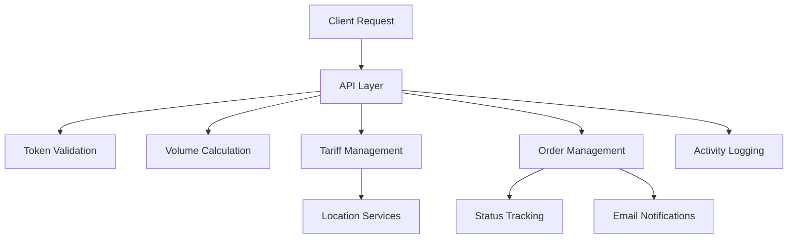

# NubeFlash Shipping API Documentation

## Overview
NubeFlash is a shipping management system that provides REST API endpoints for calculating shipping costs and managing orders. The system supports various package sizes and shipping methods, with pricing based on weight and volume.

## Shipping Cost System

### Overview
The shipping cost system is a comprehensive solution that handles pricing based on package dimensions, weight, and delivery speed. The system is implemented through a well-structured database schema and includes test data for real-world scenarios.

# Navigate to your project directory
cd /c/Users/nahue/Desktop/NubeFlash

# Start PHP's built-in web server
php -S localhost:8000

### Database Structure
The system uses several interconnected tables:

1. **Tariff Table**
```sql
CREATE TABLE IF NOT EXISTS `tariff` (
    `tariff_id` INT NOT NULL AUTO_INCREMENT,
    `destination_id` INT NOT NULL,
    `country_id` INT NOT NULL,
    `province_id` INT NOT NULL,
    `tariff_price` DECIMAL(10,2) NOT NULL,
    `weight` DECIMAL(10,2),
    `volume` DECIMAL(10,3),
    `active` TINYINT NOT NULL DEFAULT 1,
    `created_at` DATETIME DEFAULT CURRENT_TIMESTAMP,
    `updated_at` DATETIME DEFAULT CURRENT_TIMESTAMP ON UPDATE CURRENT_TIMESTAMP
)
```

2. **Location Management Tables**
- `countries`: Stores country information
- `provinces`: Manages provinces/states within countries
- `destinations`: Handles specific delivery locations with postal codes

### Pricing Structure
The system implements a tiered pricing model in Uruguayan Pesos:

1. **Small Packages** (up to 2kg / 40 x 20 x 20 cm)
   - Normal delivery: 130.00
   - 24h delivery: 160.00

2. **Medium Packages** (2-5kg / 40 x 30 x 30 cm)
   - Normal delivery: 155.00
   - 24h delivery: 185.00

3. **Large Packages** (5-20kg / 100 x 60 x 60 cm)
   - Normal delivery: 200.00
   - 24h delivery: 230.00

4. **Extra Large Packages** (20-30kg / 100 x 60 x 60 cm)
   - Normal delivery: 360.00
   - 24h delivery: 390.00

5. **Oversized Packages** (up to 40kg / 500cm³)
   - Normal delivery: 750.00
   - 24h delivery: 980.00

6. **Merchandise Pickup**
   - Fixed price: 80.00

### Shipping Cost Calculation
The system calculates shipping costs based on:
1. Package weight and volume
2. Delivery location (country, province, destination)
3. Delivery speed (normal vs 24h)
4. Customer's location validation

#### Calculation Process:
1. Validates customer token
2. Calculates volume from dimensions if provided
3. Verifies volume matches provided dimensions
4. Retrieves applicable tariff based on:
   - Postal code
   - Weight thresholds
   - Volume thresholds
5. Validates customer's country matches tariff's country
6. Returns the lowest applicable price

### Order Management
The system includes comprehensive order tracking:
```sql
CREATE TABLE IF NOT EXISTS `orders` (
    `order_id` INT NOT NULL AUTO_INCREMENT,
    `customer_id` INT NOT NULL,
    `tariff_id` INT NOT NULL,
    `status_id` INT NOT NULL,
    `order_number` VARCHAR(50) NOT NULL,
    `total_amount` DECIMAL(10,2) NOT NULL,
    `tracking_number` VARCHAR(100),
    `items` TEXT,
    `shipping_data` TEXT,
    `postal_code` VARCHAR(20),
    `weight` DECIMAL(10,2),
    `volume` DECIMAL(10,3)
)
```

### Order Statuses
The system tracks orders through various states:
1. Pendiente (Pending) - New order
2. Confirmado (Confirmed) - Order confirmed
3. En preparación (In preparation) - Being prepared
4. En tránsito (In transit) - Package in transit
5. En distribución (In distribution) - Final delivery process
6. Entregado (Delivered) - Package delivered
7. Cancelado (Cancelled) - Order cancelled
8. Devuelto (Returned) - Package returned
9. Retenido (Held) - Package held in customs
10. Extraviado (Lost) - Package lost in transit

### Activity Logging
The system maintains detailed logs of all shipping-related activities:
```sql
CREATE TABLE IF NOT EXISTS `activity_log` (
    `activity_id` INT NOT NULL AUTO_INCREMENT,
    `user_id` INT NOT NULL,
    `action` VARCHAR(50) NOT NULL,
    `description` TEXT,
    `ip_address` VARCHAR(45) NOT NULL
)
```

### Integration Capabilities
While the system includes FedEx API integration capabilities (through PHP FedEx API wrapper), it currently uses a simplified local tariff table for pricing. This provides flexibility for future international shipping integration while maintaining a straightforward current implementation.

## Registration and Authentication

### Customer Registration Process
The system provides a web-based registration form at `/registro` with the following fields:
- Razón Social (Company Name)
- RUT de empresa (Business Tax ID)
- País (Country) *
- Departamento (Province) *
- Localidad (Destination) *
- Persona de Contacto (Contact Person) *
- Teléfono (Phone) *
- Correo electrónico (Email) *
- Contraseña (Password) *
- Repetir contraseña (Confirm Password) *
- Terms and conditions acceptance
- reCAPTCHA verification

Fields marked with * are required.

### Registration Validation
The registration process includes:
1. reCAPTCHA verification
2. Password matching verification
3. Email uniqueness check
4. Required fields validation

Upon successful registration:
1. Customer data is stored in the database
2. Two tokens are generated (production and development)
3. Two confirmation emails are sent:
   - To the customer (using register_nube.php template)
   - To the admin (using register.php template)

### Email Configuration
The system uses SMTP for sending emails. Configuration is stored in `application/config/email.php`:
```php
$config['protocol'] = 'smtp';
$config['smtp_host'] = 'smtp.gmail.com';
$config['smtp_port'] = 587;
$config['smtp_crypto'] = 'tls';
$config['mailtype'] = 'html';
```

Email addresses are configured in the database:
- Email Remitente (Sender): For sending system emails
- Email Administrador: For receiving admin notifications

#### Email Templates
Email templates are located in `application/views/frontend/email/` and include:
- `register_nube.php`: Customer registration confirmation
- `register.php`: Admin notification of new registration
- `nuevo_pedido.php`: Order confirmation
- `contact.php`: Contact form submission

#### Image Handling in Emails
To ensure images display correctly in emails, the system uses two approaches:

1. **External Image Hosting**: Email templates use externally hosted images:
```php

```

2. **Dynamic URL Replacement**: The system automatically replaces localhost URLs with production URLs using a configuration setting in `application/config/config.php`:
```php
// Production site URL for emails
$config['site_url'] = 'https://lanubeflash.com';
```

## Database Structure

### Key Tables
- `customers`: Stores customer information
- `orders`: Manages shipping orders
- `tariff`: Contains shipping rates based on weight and volume
- `destinations`: Stores delivery destinations
- `provinces`: Contains province information
- `countries`: Stores country data
- `token_customers`: Stores customer API tokens
- `configurations`: Stores system settings including email configurations

## API Endpoints

### 1. Get Shipping Cost
```http
POST /frontend/api/getShippingCost
Content-Type: application/json

{
    "token": "YOUR_TOKEN",
    "data_client": {
        "postal_code": "1000"
    },
    "weight": "10",
    "long": "1",
    "width": "1",
    "high": "0.5",
    "volume": "0.5"
}
```

### 2. Get Customer
```http
POST /frontend/api/getCustomer
Content-Type: application/json

{
    "user": "customer@email.com",
    "token": "YOUR_TOKEN"
}
```

### 3. Send Order
```http
POST /frontend/api/sendOrder
Content-Type: application/json

{
    "token": "YOUR_TOKEN",
    "data_client": {
        "postal_code": "1000",
        "client": "Client Name",
        "reference": "Address Reference",
        "shipping_data": {
            "store": {
                "name": "Store Name"
            },
            "email": "client@email.com",
            "province": "Province Name",
            "city": "City Name",
            "address": "Full Address",
            "telephone": "Phone Number"
        }
    },
    "weight": "10",
    "long": "1",
    "width": "1",
    "high": "0.5",
    "volume": "0.5"
}
```

### API Endpoints

#### Shipping Cost Calculation
```
POST /frontend/api/getShippingCost
```
Request body:
```json
{
    "token": "customer_token",
    "data_client": {
        "postal_code": "1000",
        "shipping_data": {
            "store": {"name": "Store Name"},
            "email": "customer@email.com",
            "province": "Province Name",
            "city": "City Name",
            "address": "Street Address",
            "telephone": "Phone Number"
        }
    },
    "weight": 2.0,
    "volume": 0.016,
    "long": 40,
    "width": 20,
    "high": 20
}
```
Response (Success):
```json
{
    "status": "Success",
    "data": {
        "price_item": 130.00
    }
}
```

#### Create Order
```
POST /frontend/api/createOrder
```
Request body includes shipping cost calculation data plus:
```json
{
    "data_client": {
        "client": "Client Name",
        "reference": "Order Reference"
    }
}
```
Response (Success):
```json
{
    "status": "Success",
    "data": {
        "code_tracking": "generated_tracking_code"
    }
}
```

### Data Flow

1. **Shipping Cost Calculation**:
   ```mermaid
   sequenceDiagram
       Client->>API: POST /getShippingCost
       API->>TokenValidation: Validate customer token
       TokenValidation-->>API: Token valid
       API->>VolumeCalculation: Calculate & validate volume
       API->>TariffLookup: Find applicable tariff
       TariffLookup->>LocationValidation: Validate customer location
       LocationValidation-->>TariffLookup: Location valid
       TariffLookup-->>API: Return tariff price
       API-->>Client: Return shipping cost
   ```

2. **Order Creation**:
   ```mermaid
   sequenceDiagram
       Client->>API: POST /createOrder
       API->>ShippingCost: Calculate shipping cost
       ShippingCost-->>API: Cost calculated
       API->>OrderCreation: Create order record
       OrderCreation->>TrackingGeneration: Generate tracking number
       TrackingGeneration-->>OrderCreation: Tracking number
       OrderCreation-->>API: Order created
       API->>EmailNotification: Send confirmation emails
       API-->>Client: Return tracking code
   ```

### Evolution of the System

The shipping cost system has evolved through several iterations:

1. **Initial Version**:
   - Exact weight/volume matching
   - Simple pricing structure
   - Basic location validation

2. **Current Version**:
   - Threshold-based pricing
   - Volume calculation from dimensions
   - Enhanced location validation
   - Comprehensive order tracking
   - Activity logging
   - Email notifications

3. **Future Capabilities**:
   - FedEx API integration ready
   - Extensible for international shipping
   - Flexible pricing model support

### System Components Interaction



## Shipping Rates

### Package Categories and Prices (in Uruguayan Pesos)

1. Small Packages (Hasta 2Kg)
   - Dimensions: 40 x 20 x 20 cm (Volume: 0.016 m³)
   - Normal delivery: $130
   - 24h delivery: $160

2. Medium Packages (2-5 Kg)
   - Dimensions: 40 x 30 x 30 cm (Volume: 0.036 m³)
   - Normal delivery: $155
   - 24h delivery: $185

3. Large Packages (5-20 Kg)
   - Dimensions: 100 x 60 x 60 cm (Volume: 0.360 m³)
   - Normal delivery: $200
   - 24h delivery: $230

4. Extra Large Packages (20-30 Kg)
   - Dimensions: 100 x 60 x 60 cm (Volume: 0.360 m³)
   - Normal delivery: $360
   - 24h delivery: $390

5. Oversized Packages
   - Volume: 0.500 m³ and above
   - Normal delivery: $750
   - 24h delivery: $980

6. Merchandise Pickup
   - Fixed price: $80

### Storage Prices (in USD)
- Minimum Storage (10 m²): $90
- Complete Storage (50 m²): $400

## Volume Calculation Formula
Volume is calculated in cubic meters (m³) using the following formula:
```
volume = length * width * height
```
Where:
- length, width, and height are in meters
- Result is rounded to 3 decimal places

Example:
```
Package dimensions: 1m x 1m x 0.5m
Volume = 1 * 1 * 0.5 = 0.500 m³
```

## Response Formats

### Successful Response
```json
{
    "status": "Success",
    "data": {
        "code_tracking": "e05f39d425ba9683aa2cae5ac266917f5b11624d"
    }
}
```

### Error Response
```json
{
    "status": "Error",
    "data": {
        "message": "Error message description"
    }
}
```

## Error Messages
- "Token is invalid"
- "Client no exists"
- "Volume Invalid"
- "Invalid weight or volume"
- "Tariff no exists"
- "Country doesn't match"

## Email Notifications
The system automatically sends email notifications to:
1. Customer (order confirmation)
2. Admin (new order notification)
3. Orders team (order processing)

## Security
- CSRF protection is disabled for API endpoints
- API uses token-based authentication
- Tokens are customer-specific and must be valid
- All requests require Content-Type: application/json header

## Rate Limits
- Maximum file upload size: 40MB
- Session timeout: 7200 seconds (2 hours)
- Login attempts are monitored and logged

## Authentication System

The system has two distinct authentication mechanisms:

### 1. Customer Authentication (Frontend/API)
- Used for: End customers, shipping service users, API access
- Table: `customers`
- Login endpoint: `/frontend/ajax/login`
- API authentication: Token-based
- Access to: Frontend interface and API endpoints

### 2. Administrative Authentication (Backend)
- Used for: Admins, staff, support team
- Table: `users`
- Login endpoint: `/backend/auth/login`
- Authentication: Session-based with Ion Auth
- Access to: Admin panel and backend features

## Detailed Authentication Guide

### Customer Registration Process

1. **Web Registration** (Recommended for new customers)
```http
POST /frontend/web/register
Content-Type: application/json

{
    "social_reason": "Test Company SRL",
    "fiscal_identifier": "30123456789",
    "person_contact": "John Test",
    "telephone": "+541112345678",
    "email": "test@testcompany.com",
    "password": "Test@123",
    "country": 1,
    "province": 1,
    "destination": 1
}
```

2. **Direct Database Registration** (Admin only)
```sql
-- 1. Insert customer record
INSERT INTO customers (
    name, surname, email, password, telephone,
    address, province, country_id, active
) VALUES (
    'Test Company', 'SRL', 'test@testcompany.com',
    SHA1('Test@123'), '+541112345678',
    'Test Address 123', 'Buenos Aires', 1, 1
);

-- 2. Get the customer_id
SET @customer_id = LAST_INSERT_ID();

-- 3. Generate production token
INSERT INTO token_customers (customer_id, token, active)
VALUES (
    @customer_id,
    CONCAT('tk_testcompany_', SHA2(CONCAT(RAND(), NOW()), 256)),
    1
);

-- 4. Generate development token
INSERT INTO token_customers (customer_id, token, active)
VALUES (
    @customer_id,
    CONCAT('Dev-tk_testcompany_', SHA2(CONCAT(RAND(), NOW()), 256)),
    1
);
```

### Token Management Through Admin Interface

1. **View Customer Tokens**
```http
GET /backend/customers/tokens/{customer_id}
```

2. **Generate New Token**
```http
POST /backend/customers/generateToken
Content-Type: application/json

{
    "customer_id": 123,
    "token_type": "production" // or "development"
}
```

3. **Revoke Token**
```http
POST /backend/customers/revokeToken
Content-Type: application/json

{
    "token": "tk_testcompany_hash..."
}
```

4. **List All Active Tokens**
```http
GET /backend/customers/tokens
```

### Testing Your Integration

1. **Get Your Tokens**
```bash
# Login first
curl -X POST "http://localhost:8000/frontend/ajax/login" \
-H "Content-Type: application/json" \
-d '{
    "email": "test@testcompany.com",
    "password": "Test@123"
}'

# Then get your tokens
curl -X GET "http://localhost:8000/frontend/ajax/getTokens" \
-H "Content-Type: application/json"
```

2. **Test Production Token**
```bash
# Test shipping cost calculation
curl -X POST "http://localhost:8000/frontend/api/getShippingCost" \
-H "Content-Type: application/json" \
-d '{
    "token": "YOUR_PRODUCTION_TOKEN",
    "data_client": {
        "postal_code": "1000"
    },
    "weight": "2",
    "long": "0.4",
    "width": "0.2",
    "high": "0.2",
    "volume": "0.016"
}'
```

3. **Test Development Token**
```bash
# Same endpoint with development token
curl -X POST "http://localhost:8000/frontend/api/getShippingCost" \
-H "Content-Type: application/json" \
-d '{
    "token": "YOUR_DEV_TOKEN",
    "data_client": {
        "postal_code": "1000"
    },
    "weight": "2",
    "long": "0.4",
    "width": "0.2",
    "high": "0.2",
    "volume": "0.016"
}'
```

### Common Token Operations

1. **Check Token Validity**
```sql
SELECT 
    c.name,
    c.email,
    tc.token,
    tc.created_at,
    CASE 
        WHEN tc.active = 1 THEN 'Valid'
        ELSE 'Revoked'
    END as status
FROM token_customers tc
JOIN customers c ON c.customer_id = tc.customer_id
WHERE tc.token = 'YOUR_TOKEN';
```

2. **Monitor Token Usage**
```sql
SELECT 
    DATE(created_at) as date,
    COUNT(*) as requests
FROM activity_log
WHERE token = 'YOUR_TOKEN'
GROUP BY DATE(created_at)
ORDER BY date DESC;
```

3. **Regenerate Token**
```sql
-- 1. Revoke old token
UPDATE token_customers 
SET active = 0 
WHERE token = 'OLD_TOKEN';

-- 2. Generate new token
INSERT INTO token_customers (
    customer_id, token, active
) 
SELECT 
    customer_id,
    CONCAT('tk_', LOWER(REPLACE(name, ' ', '')), '_', 
           SHA2(CONCAT(RAND(), NOW()), 256)),
    1
FROM customers 
WHERE customer_id = [CUSTOMER_ID];
```

### Best Practices

1. **Token Security**
   - Store tokens securely
   - Never share tokens publicly
   - Use HTTPS for all API calls
   - Rotate tokens periodically
   - Use development tokens for testing

2. **Rate Limiting**
   - Stay within 1000 requests/hour limit
   - Implement exponential backoff
   - Cache responses when possible
   - Monitor usage patterns

3. **Error Handling**
   - Handle token expiration
   - Implement proper retry logic
   - Log failed attempts
   - Monitor error rates

## Development Setup
1. Create database:
```sql
mysql -u your_username -p lanube_api < create_database.sql
```

2. Insert test data:
```sql
mysql -u your_username -p lanube_api < insert_test_data.sql
```

## Example Customer Setup

1. Create customer and generate token:
```sql
-- Insert customer
INSERT INTO customers (
    name, email, password, country_id, active
) VALUES (
    'New Company', 
    'contact@newcompany.com',
    SHA1('secure_password'),
    1,  -- country_id for Argentina
    1   -- active
);

-- Generate token
INSERT INTO token_customers (
    customer_id, token, active
) VALUES (
    LAST_INSERT_ID(),
    CONCAT('tk_newcompany_', SHA2(CONCAT(RAND(), NOW()), 256)),
    1
);
```

2. Retrieve customer token:
```sql
SELECT token 
FROM token_customers 
WHERE customer_id = [CUSTOMER_ID] 
AND active = 1;
```

## Testing
Example curl command for testing the sendOrder endpoint:
```bash
curl -X POST "http://localhost:8000/frontend/api/sendOrder" \
-H "Content-Type: application/json" \
-d '{
    "token": "YOUR_TOKEN",
    "data_client": {
        "postal_code": "1000",
        "client": "Empresa A",
        "reference": "Av. Corrientes 1234",
        "shipping_data": {
            "store": {
                "name": "Test Store"
            },
            "email": "contacto@empresaa.com",
            "province": "Buenos Aires",
            "city": "Buenos Aires",
            "address": "Av. Corrientes 1234",
            "telephone": "+54933333333"
        }
    },
    "weight": "10",
    "long": "1",
    "width": "1",
    "high": "0.5",
    "volume": "0.5"
}'
```

## Application Configuration

### Environment Setup
The application is built on CodeIgniter 3.1.13 with PHP 7.3.33 and requires specific configuration to function properly.

### Database Configuration
The database connection is configured in `application/config/database.php` with three environments:

1. **Development Environment** (default)
```php
$db['developed'] = array(
    'hostname' => 'localhost',
    'username' => 'root',
    'password' => '',
    'database' => 'lanube_api',
    'dbdriver' => 'mysqli',
    'char_set' => 'utf8mb4',
    'dbcollat' => 'utf8mb4_general_ci',
    'port'     => '3306'
);
```

2. **Testing Environment**
```php
$db['testing'] = array(
    'hostname' => 'localhost',
    'username' => 'elfiko_tienda',
    'password' => 'admin2016',
    'database' => 'elfiko_giordana',
    'dbdriver' => 'mysqli',
    'char_set' => 'utf8',
    'dbcollat' => 'utf8_general_ci'
);
```

3. **Production Environment**
```php
$db['production'] = array(
    'hostname' => 'localhost',
    'username' => 'lanubeflash',
    'password' => 'Y8Ixrqc3Yn38V6B',
    'database' => 'lanubeflash',
    'dbdriver' => 'mysqli',
    'char_set' => 'utf8',
    'dbcollat' => 'utf8_general_ci'
);
```

The active database group is set with:
```php
$active_group = 'developed';
```

### Base URL Configuration
The application uses dynamic base URL detection in `application/config/config.php`:

```php
$protocol = isset($_SERVER['HTTP_X_FORWARDED_PROTO']) ? $_SERVER['HTTP_X_FORWARDED_PROTO'] : 'http';
$config['base_url'] = $protocol . "://" . (isset($_SERVER['HTTP_HOST']) ? $_SERVER['HTTP_HOST'] : 'localhost:8000');
```

This allows the application to work correctly in various environments without manual URL configuration.

### Directory Permissions
The following directories require write permissions:

1. `application/logs/` - For error logging
2. `application/cache/` - For caching
3. `application/sessions/` - For session storage

Each directory should have:
- Directory permissions: 755 (rwxr-xr-x)
- File permissions: 644 (rw-r--r--)

For Windows environments, ensure the web server has write access to these directories.

### Security Recommendations

#### Password Security
Current implementation:
- Passwords are stored using SHA1 hashing
- Password complexity requirements implemented:
  - Minimum length: 8 characters
  - Requires at least one uppercase letter (A-Z)
  - Requires at least one special character (e.g., !@#$%^&*)
- Real-time password validation with visual feedback
- Current password verification before password changes

Implemented enhancements:
1. **Password Change Functionality**:
   - "Cambiar contraseña" modal in user dropdown menu
   - Current password verification
   - Real-time validation feedback
   - Visual indicators for password strength

2. **Frontend Validation**:
   - JavaScript validation using regex pattern `^(?=.*[A-Z])(?=.*[!@#$%^&*]).{8,}$`
   - Disabled new password fields until current password is verified
   - Color-coded feedback messages

3. **Backend Validation**:
   - Server-side validation of current password
   - Server-side validation of password complexity
   - CSRF protection for security

Future recommended improvements:
1. Use stronger hashing algorithm (bcrypt or Argon2)
2. Implement password expiration policy
3. Add failed login attempt monitoring

#### Token Security
- Production and development tokens are generated automatically
- Tokens use SHA2 with random data and timestamps
- Tokens are customer-specific
- Active status tracking for token revocation

#### General Security
1. CSRF Protection:
   - Enabled for web forms
   - Disabled for API endpoints
2. reCAPTCHA:
   - Required for registration
   - Prevents automated submissions
3. Session Management:
   - 2-hour timeout
   - Secure session handling
4. Input Validation:
   - Server-side validation for all inputs
   - SQL injection prevention
   - XSS protection

#### JavaScript Security and Optimization
1. **jQuery Reference Error Fixes**:
   - jQuery loaded in the head section for early availability
   - Use of `jQuery` instead of `$` shorthand for compatibility
   - Fallback mechanisms for critical operations
   - Conditional checks for jQuery availability

2. **Script Loading Optimization**:
   - Proper script loading order to avoid dependency issues
   - Minimized duplicate script loading
   - Vanilla JavaScript used where appropriate for performance

## Development Setup
1. Create database:
```sql
mysql -u your_username -p lanube_api < create_database.sql
```

2. Insert test data:
```sql
mysql -u your_username -p lanube_api < insert_test_data.sql
```

## Example Customer Setup

1. Create customer and generate token:
```sql
-- Insert customer
INSERT INTO customers (
    name, email, password, country_id, active
) VALUES (
    'New Company', 
    'contact@newcompany.com',
    SHA1('secure_password'),
    1,  -- country_id for Argentina
    1   -- active
);

-- Generate token
INSERT INTO token_customers (
    customer_id, token, active
) VALUES (
    LAST_INSERT_ID(),
    CONCAT('tk_newcompany_', SHA2(CONCAT(RAND(), NOW()), 256)),
    1
);
```

2. Retrieve customer token:
```sql
SELECT token 
FROM token_customers 
WHERE customer_id = [CUSTOMER_ID] 
AND active = 1;
```

## Testing
Example curl command for testing the sendOrder endpoint:
```bash
curl -X POST "http://localhost:8000/frontend/api/sendOrder" \
-H "Content-Type: application/json" \
-d '{
    "token": "YOUR_TOKEN",
    "data_client": {
        "postal_code": "1000",
        "client": "Empresa A",
        "reference": "Av. Corrientes 1234",
        "shipping_data": {
            "store": {
                "name": "Test Store"
            },
            "email": "contacto@empresaa.com",
            "province": "Buenos Aires",
            "city": "Buenos Aires",
            "address": "Av. Corrientes 1234",
            "telephone": "+54933333333"
        }
    },
    "weight": "10",
    "long": "1",
    "width": "1",
    "high": "0.5",
    "volume": "0.5"
}'
```

## Application Configuration

### Environment Setup
The application is built on CodeIgniter 3.1.13 with PHP 7.3.33 and requires specific configuration to function properly.

### Database Configuration
The database connection is configured in `application/config/database.php` with three environments:

1. **Development Environment** (default)
```php
$db['developed'] = array(
    'hostname' => 'localhost',
    'username' => 'root',
    'password' => '',
    'database' => 'lanube_api',
    'dbdriver' => 'mysqli',
    'char_set' => 'utf8mb4',
    'dbcollat' => 'utf8mb4_general_ci',
    'port'     => '3306'
);
```

2. **Testing Environment**
```php
$db['testing'] = array(
    'hostname' => 'localhost',
    'username' => 'elfiko_tienda',
    'password' => 'admin2016',
    'database' => 'elfiko_giordana',
    'dbdriver' => 'mysqli',
    'char_set' => 'utf8',
    'dbcollat' => 'utf8_general_ci'
);
```

3. **Production Environment**
```php
$db['production'] = array(
    'hostname' => 'localhost',
    'username' => 'lanubeflash',
    'password' => 'Y8Ixrqc3Yn38V6B',
    'database' => 'lanubeflash',
    'dbdriver' => 'mysqli',
    'char_set' => 'utf8',
    'dbcollat' => 'utf8_general_ci'
);
```

The active database group is set with:
```php
$active_group = 'developed';
```

### Base URL Configuration
The application uses dynamic base URL detection in `application/config/config.php`:

```php
$protocol = isset($_SERVER['HTTP_X_FORWARDED_PROTO']) ? $_SERVER['HTTP_X_FORWARDED_PROTO'] : 'http';
$config['base_url'] = $protocol . "://" . (isset($_SERVER['HTTP_HOST']) ? $_SERVER['HTTP_HOST'] : 'localhost:8000');
```

This allows the application to work correctly in various environments without manual URL configuration.

### Directory Permissions
The following directories require write permissions:

1. `application/logs/` - For error logging
2. `application/cache/` - For caching
3. `application/sessions/` - For session storage

Each directory should have:
- Directory permissions: 755 (rwxr-xr-x)
- File permissions: 644 (rw-r--r--)

For Windows environments, ensure the web server has write access to these directories.

### Security Configuration
Each sensitive directory contains an `.htaccess` file to prevent direct access:

```apache
<IfModule authz_core_module>
    Require all denied
</IfModule>
<IfModule !authz_core_module>
    Deny from all
</IfModule>
```

### Environment Setting
The application environment is configured in `index.php`:

```php
define('ENVIRONMENT', isset($_SERVER['CI_ENV']) ? $_SERVER['CI_ENV'] : 'development');
```

This setting affects error reporting and other environment-specific behaviors:
- `development`: Full error reporting with display_errors enabled
- `testing` or `production`: Limited error reporting with display_errors disabled

### Additional Configuration
- **Timezone**: Set to 'America/Buenos_Aires'
- **Time Limit**: Set to 0 (unlimited)
- **Upload Max Filesize**: Set to 40MB
- **Index Page**: Set to empty string for clean URLs
- **URI Protocol**: Set to REQUEST_URI


###################
What is CodeIgniter
###################

CodeIgniter is an Application Development Framework - a toolkit - for people
who build web sites using PHP. Its goal is to enable you to develop projects
much faster than you could if you were writing code from scratch, by providing
a rich set of libraries for commonly needed tasks, as well as a simple
interface and logical structure to access these libraries. CodeIgniter lets
you creatively focus on your project by minimizing the amount of code needed
for a given task.

*******************
Release Information
*******************

This repo contains in-development code for future releases. To download the
latest stable release please visit the `CodeIgniter Downloads
<https://codeigniter.com/download>`_ page.

**************************
Changelog and New Features
**************************

You can find a list of all changes for each release in the `user
guide change log <https://github.com/bcit-ci/CodeIgniter/blob/develop/user_guide_src/source/changelog.rst>`_.

*******************
Server Requirements
*******************

PHP version 5.6 or newer is recommended.

It should work on 5.3.7 as well, but we strongly advise you NOT to run
such old versions of PHP, because of potential security and performance
issues, as well as missing features.

************
Installation
************

Please see the `installation section <https://codeigniter.com/userguide3/installation/index.html>`_
of the CodeIgniter User Guide.

*******
License
*******

Please see the `license
agreement <https://github.com/bcit-ci/CodeIgniter/blob/develop/user_guide_src/source/license.rst>`_.

*********
Resources
*********

-  `User Guide <https://codeigniter.com/docs>`_
-  `Contributing Guide <https://github.com/bcit-ci/CodeIgniter/blob/develop/contributing.md>`_
-  `Language File Translations <https://github.com/bcit-ci/codeigniter3-translations>`_
-  `Community Forums <http://forum.codeigniter.com/>`_
-  `Community Wiki <https://github.com/bcit-ci/CodeIgniter/wiki>`_
-  `Community Slack Channel <https://codeigniterchat.slack.com>`_

Report security issues to our `Security Panel <mailto:security@codeigniter.com>`_
or via our `page on HackerOne <https://hackerone.com/codeigniter>`_, thank you.

***************
Acknowledgement
***************

The CodeIgniter team would like to thank EllisLab, all the
contributors to the CodeIgniter project and you, the CodeIgniter user.

## PDF Document Handling

### Overview
The system implements a robust approach to serving PDF documents such as Terms and Conditions and Privacy Policy. This implementation ensures compatibility across different environments and provides multiple access methods.

### Storage Strategy
PDF documents are stored in two locations for redundancy:

1. **Primary Location**: `assets/public/` directory
2. **Secondary Location**: `assets/frontend/web/pdf/` directory with subdirectories for each document type

### Access Methods
The system provides three different methods for accessing PDF files:

1. **Direct Controller Method** (`Web::pdf`)
   - Maps identifiers to filenames
   - Example URL: `/frontend/web/pdf/politicas`

2. **Dedicated PDF Methods** (`Web::politicas_pdf`, `Web::terminos_pdf`)
   - Specifically designed for each document type
   - Example URL: `/politicas-pdf`

3. **Generic PDF Serving** (`Web::serve_pdf`)
   - Serves any PDF file with security checks
   - Example URL: `/pdf/document-name.pdf`

### Implementation Features
- Fallback mechanism for file location
- Comprehensive error logging
- Security measures to prevent unauthorized access
- Proper HTTP headers for optimal PDF display

### Routes Configuration
```php
$route['frontend/web/pdf/(:any)'] = "frontend/web/pdf/$1";
$route['politicas-pdf'] = "frontend/web/politicas_pdf";
$route['terminos-pdf'] = "frontend/web/terminos_pdf";
$route['pdf/(:any)'] = "frontend/web/serve_pdf/$1";
```

## Recent Updates

### March 2025
- Fixed activity_log table INSERT statement in insert_test_data.sql (changed user_id to id_user)
- Fixed login_attempts table INSERT statement in insert_test_data.sql
- Changed users table primary key from `user_id` to `id_user` for naming consistency
- Added additional admin users with password "test123" for testing
- Fixed login page CSRF protection issues
- Improved footer positioning on login and registration pages
- Enhanced registration success message for better readability
- Added responsive design improvements for login forms

For detailed information about these updates, please refer to [READMENOW3.md](./READMENOW3.md#recent-updates-and-fixes).

## Backend Administration

The system includes a comprehensive backend administration panel accessible at `/backend/auth/login`. Default login credentials are:
- Username: `admin@admin.com`
- Password: `password`

The backend provides access to various management sections:
- Customer Management
- Order Management
- Tariff Management
- Location Management
- User Management
- System Configuration
- Reports
- Activity Logs

For a complete list of available backend pages and detailed instructions, refer to [READMENOW3.md](./READMENOW3.md#backend-administration).
